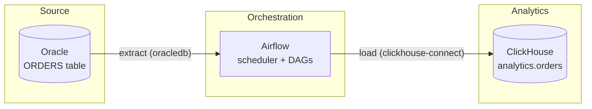

# Oracle → ClickHouse via Airflow — Presentation & Live-Coding Guide

This document has two parts:

1. **Explanation** — what this project is, the concepts behind each piece, and why it's built this way. Read this to prepare.
2. **Live-coding script** — exact commands to run in front of your team, in order, with what to say and what to expect on screen.

---

## Part 1: Explanation

### 1.1 The goal

Pull data out of an Oracle database and load it into ClickHouse, orchestrated by Airflow. This is a classic **ELT/ETL batch pipeline**: a source OLTP-ish system (Oracle) holds the data as it's created; a fast analytical database (ClickHouse) holds a copy optimized for queries and reporting; Airflow is the scheduler/orchestrator that moves data from one to the other on a schedule.



The three "head team" exercises (Docker, ClickHouse, Airflow) are really the three legs this pipeline stands on. This project does all three as one connected system instead of three disconnected toy exercises, which is closer to how it looks in production.

### 1.2 Concept primer: Docker

- **Image**: a read-only template (filesystem + metadata) built from a `Dockerfile`. Think "class."
- **Container**: a running instance of an image. Think "object." You can run many containers from one image.
- **Dockerfile**: a recipe — start `FROM` a base image, layer on changes (`COPY`, `RUN`).
- **Volume**: persistent storage that survives container restarts/recreation, independent of the container's writable layer. We use volumes for Postgres/ClickHouse/Oracle data directories — delete the container, the data stays; delete the *volume* (`-v`), the data is gone.
- **Networking**: `docker-compose` puts all services on one network and gives each a DNS name matching its service name (`clickhouse`, `oracle`, `postgres`) — that's how the Airflow container finds ClickHouse without hardcoded IPs.
- **docker-compose**: declarative multi-container orchestration. One `docker-compose.yml` describes every service, how they depend on each other (`depends_on` + healthchecks), and what to expose.

This project's images:
- `docker/airflow/Dockerfile` — extends the official Airflow image, adds our two Python dependencies (`oracledb`, `clickhouse-connect`).
- `docker/clickhouse/Dockerfile` — extends the official ClickHouse image, adds one config override file.

### 1.3 Concept primer: ClickHouse

- **Columnar storage**: unlike Oracle/Postgres (row-oriented — a full row is stored together), ClickHouse stores each *column* contiguously on disk. Queries that touch a few columns of a huge table (typical for analytics: `SELECT sum(amount) GROUP BY country`) only read those columns, not whole rows — this is the core reason it's fast for aggregation-heavy workloads, and a core reason it's a poor fit for OLTP (single-row lookups/updates).
- **MergeTree family**: ClickHouse's main table engine family. Data is written in small immutable parts, which a background process periodically merges into fewer, larger, sorted parts. This project uses `ReplacingMergeTree`, a MergeTree variant that — during a merge — keeps only the *last* row for each duplicate sort key (by a "version" column we specify). We use this for **idempotent upserts**: re-running a load that re-sends an unchanged or updated row doesn't create bad duplicates, it just self-heals on the next merge.
- **ORDER BY (the sorting/primary key)**: MergeTree tables are physically sorted on disk by this key. It's both how ClickHouse prunes data during queries (skips whole blocks that can't match) *and*, for `ReplacingMergeTree`, the key duplicates are detected on. Get this wrong (as we did — see §1.6) and dedup silently breaks.
- **PARTITION BY**: splits data into physically separate parts by an expression (we use `toYYYYMM(order_date)`, i.e. one partition per month) — mostly an operational convenience (drop/backup old months cheaply), not a query-speed primitive by itself.
- **FINAL**: forces ClickHouse to do the `ReplacingMergeTree` dedup merge *at query time* instead of waiting for the background merge. Correct but expensive at scale, which is why we wrapped it in a view (`analytics.orders_latest`) instead of asking every query to say `FINAL` by hand.
- **Sharding / replication / Keeper** (mentioned in your team's exercise, not built here): sharding splits a table's *data* across multiple nodes (scale-out); replication copies the *same* data to multiple nodes (fault tolerance); ClickHouse Keeper (a ZooKeeper-compatible service) coordinates replicas. This project intentionally runs single-node — that's the right first step, and worth saying explicitly in the presentation so it's clear it's a scoping choice, not a gap.

### 1.4 Concept primer: Airflow

- **DAG** (Directed Acyclic Graph): a Python-defined workflow — a set of tasks and the dependencies between them. "Acyclic" — no loops; data flows one direction.
- **Task / Operator**: a task is one unit of work in a DAG. An operator is the *type* of task (`PythonOperator`, or here, the `@task` TaskFlow decorator which is sugar over `PythonOperator`).
- **XCom** ("cross-communication"): the mechanism tasks use to pass small values to each other. In TaskFlow syntax, just returning a value from one `@task` function and passing it as an argument to another does this automatically (see `dags/hello_world.py`).
- **Scheduling**: a DAG's `schedule` parameter controls automatic runs; `schedule=None` here means "manual/triggered only" — appropriate while we're building and demoing.
- **Connections**: Airflow's built-in way to store credentials for external systems, normally configured via the UI/CLI rather than env vars. We used plain environment variables instead (see §1.7 for why) — worth being upfront about this trade-off if asked.
- **Architecture**: the **scheduler** parses DAG files and decides what should run when; the **webserver** serves the UI; the **executor** (we use `LocalExecutor` — runs tasks as local subprocesses, no external broker) actually runs task code; the **metadata DB** (Postgres here) is where all of this state — DAG runs, task instances, XComs — lives. All of Airflow's "brain" is really just rows in that Postgres database.

### 1.5 The pipeline itself

Two DAGs, deliberately built as two stages of the same idea:

**`oracle_to_clickhouse_full_refresh`** (`dags/oracle_to_clickhouse_full_refresh.py`)
Pulls *every* row from Oracle's `ORDERS` table, inserts into ClickHouse. Simple, always correct, but re-reads and re-inserts the entire source table every run — fine for small tables or first loads, doesn't scale.

**`oracle_to_clickhouse_incremental`** (`dags/oracle_to_clickhouse_incremental.py`)
1. `get_watermark` — asks ClickHouse for `max(updated_at)` across everything currently loaded.
2. `extract_from_oracle` — pulls only Oracle rows where `updated_at >` that watermark.
3. `load_into_clickhouse` — inserts just those rows.

This is the standard **watermark-based incremental load** pattern. It's cheap to run frequently (only moves the delta), and it's safe to re-run: if a row's `updated_at` ties exactly with the watermark and gets re-sent, `ReplacingMergeTree` collapses the duplicate on merge rather than double-counting it.

Both DAGs share `src/pipeline/`:
- `config.py` — reads Oracle/ClickHouse connection settings from environment variables (already wired into `docker-compose.yml`).
- `oracle_client.py` — `fetch_orders()`, optionally filtered by `since`.
- `clickhouse_client.py` — `insert_orders()` and `max_updated_at()`.

Kept deliberately un-abstracted (no generic "any table" framework) — there's exactly one table right now, and building a generic loader before a second table exists would be speculative complexity with no current payoff.

### 1.6 Bugs found and fixed while building this (good talking points)

These are worth mentioning in the presentation — they show you understand the systems, not just that you followed a tutorial:

| Bug | Root cause | Fix |
|---|---|---|
| ClickHouse healthcheck always failed | `wget http://localhost:8123` resolved `localhost` to IPv6 `::1` first; this Docker environment has no IPv6 socket support | Pinned healthchecks to `127.0.0.1` |
| ClickHouse container crash-looped | An XML comment I wrote contained `--` (illegal inside XML comments — hard XML spec rule) | Reworded the comment |
| ClickHouse wouldn't bind any port | Base image ships a default IPv6-only `listen_host`; my override *appended* instead of replacing it | Used `replace="1"` on the `<listen_host>` element |
| Airflow scheduler healthcheck always failed | I guessed an HTTP `/health` endpoint that doesn't exist for the scheduler in this Airflow version | Used the correct check: `airflow jobs check --job-type SchedulerJob` |
| Oracle container failed with `ORA-65012` | Set `ORACLE_DATABASE=FREEPDB1`, the same name as the image's pre-baked default PDB — tried to create a duplicate | Removed the redundant env var |
| Oracle init script failed with `ORA-01435: user does not exist` | Init `.sql` scripts run via a local `sysdba` connection that lands in the **root CDB**, not the `FREEPDB1` pluggable database where the app user lives | Added `ALTER SESSION SET CONTAINER = FREEPDB1;` before switching schema |
| **Silent data-correctness bug**: `ReplacingMergeTree` dedup wasn't collapsing duplicate orders | Oracle's `order_date` is a `DATE` (no time-of-day); ClickHouse's column was `DateTime` and my sample CSV had invented times. Since `ORDER BY (order_date, order_id)` is the dedup key, the same `order_id` from two sources had two different sort keys and never merged | Changed `order_date` to `Date` (it's a business date; `updated_at` already carries real timestamp precision) |

That last one is the most important story to tell: it didn't error, it didn't crash — it just silently gave a wrong row count, and would only get caught by someone actually checking the numbers against expectations. That's the kind of bug that matters most in a real analytics pipeline.

### 1.7 Known simplifications (be upfront about these)

- Airflow connects to Oracle/ClickHouse via plain environment variables in `docker-compose.yml`, not Airflow's built-in **Connections** UI/CRUD. Simpler for a from-scratch build; a real deployment would likely use Connections (or a secrets backend) so credentials aren't baked into compose files.
- Both DAGs have `schedule=None` (manual trigger only) — intentional while building/demoing; flipping to e.g. `schedule="*/15 * * * *"` is a one-line change once you want it running unattended.
- Single ClickHouse node, no replication/Keeper — correct scope for this exercise; that's the next layer if this becomes a shared/production service.
- One table (`orders`). The pipeline code is intentionally not generalized to "any table" yet — that abstraction should wait until there's a second real table to prove it against.

---

## Part 2: Live-Coding Script

Goal: show the whole stack coming up from nothing, then prove the pipeline actually moves and reconciles data correctly — not just "the commands didn't error."

**Before you present**: run `docker compose down -v` once beforehand if you want the *first* live demo to also show first-boot behavior (slower, more dramatic); otherwise leave containers as-is and just `docker compose up -d` (much faster, safer if you're short on time). The script below assumes a clean start; skip the down/up if you're short on time and jump to "Act 3" with everything already running.

### Act 0 — orient the room (no commands, ~1 min)

Show the repo structure, say the one-sentence version: *"Oracle has the data, ClickHouse is where we want it for analytics, Airflow moves it on a schedule. Everything runs in Docker so it's reproducible on any machine."*

### Act 1 — Docker: build and run a service image (~2 min)

```bash
docker compose config
```
> "This validates and renders the full compose file — services, networks, volumes, env vars all resolved."

```bash
docker compose build clickhouse
```
> "Building an image from our Dockerfile — official ClickHouse base image plus one config override file."

### Act 2 — bring up the full stack from a clean slate (~3 min, mostly waiting)

```bash
docker compose down -v
docker compose up -d postgres clickhouse oracle
docker compose ps
```
> "Postgres is Airflow's metadata store. ClickHouse and Oracle are our two data systems. `-v` on the way down wiped all volumes, so this is a true first boot." Wait for all three `healthy`.

```bash
docker compose up -d airflow-init
docker compose up -d airflow-webserver airflow-scheduler
docker compose ps
```
> "airflow-init runs database migrations and creates the admin user, once, then exits. Webserver and scheduler are the two long-running Airflow processes." Wait for both `healthy`.

### Act 3 — ClickHouse: table, data, queries (~3 min)

```bash
for f in sql/clickhouse/ddl/*.sql; do
  docker compose exec -T clickhouse clickhouse-client --user default --password clickhouse_pw --multiquery < "$f"
done
```
> "Creates the database, the `orders` table — `ReplacingMergeTree`, partitioned by month — and a view that handles dedup for us."

```bash
docker compose exec -T clickhouse clickhouse-client --user default --password clickhouse_pw \
  --query "INSERT INTO analytics.orders FORMAT CSVWithNames" < sql/clickhouse/sample_data/orders_sample.csv
```

```bash
docker compose exec -T clickhouse clickhouse-client --user default --password clickhouse_pw --multiquery \
  < sql/clickhouse/queries/example_queries.sql
```
> Talk through the output live: revenue by month, by country, status breakdown, and the last query demonstrating `FINAL` dedup on a row that was cancelled after creation.

### Act 4 — Airflow: a DAG runs (~2 min)

```bash
docker compose exec -T airflow-webserver airflow dags list
```
> "All three DAGs registered: a sanity-check hello-world, and our two pipeline DAGs."

```bash
docker compose exec -T airflow-webserver airflow dags trigger hello_world
docker compose exec -T airflow-webserver airflow dags list-runs -d hello_world
```
> If you have a browser handy, this is the moment to flip to `http://localhost:8080` (admin/admin) and show the graph view — much more visual than the CLI.

### Act 5 — the actual pipeline: full refresh (~2 min)

```bash
docker compose exec -T airflow-webserver airflow dags trigger oracle_to_clickhouse_full_refresh
docker compose exec -T airflow-webserver airflow dags list-runs -d oracle_to_clickhouse_full_refresh
```

```bash
docker compose exec -T clickhouse clickhouse-client --user default --password clickhouse_pw \
  --query "SELECT count() FROM analytics.orders_latest"
```
> "20 — Oracle's 10 rows and the CSV's 20 rows overlap on 10 order IDs, and dedup correctly collapses them to 20 unique orders."

### Act 6 — the payoff: incremental load with live data (~4 min, this is the highlight)

```bash
docker compose exec -T airflow-webserver airflow dags trigger oracle_to_clickhouse_incremental
```
> "Baseline run — should find nothing new, since Oracle hasn't changed since the full refresh." Show the task log finds `0 rows`.

Now simulate real activity landing in the source system:

```bash
docker compose exec -T oracle sqlplus -s / as sysdba < sql/oracle/simulate_new_activity.sql
```
> "This inserts one brand-new order and changes the status on an existing one — standing in for 'the app wrote new data to Oracle.'"

```bash
docker compose exec -T airflow-webserver airflow dags trigger oracle_to_clickhouse_incremental
```

```bash
docker compose exec -T clickhouse clickhouse-client --user default --password clickhouse_pw \
  --query "SELECT order_id, order_status, order_date, updated_at FROM analytics.orders_latest WHERE order_id IN (1005, 1021) ORDER BY order_id"
```
> "1021 is new. 1005's status changed — and ClickHouse shows the *new* value, not a duplicate row, because of the `ReplacingMergeTree` version column. This is the incremental pattern working end to end: only the delta moved, and the destination table stayed correct."

### Closing line

> "Everything you just watched — Docker, ClickHouse, and Airflow — is one connected pipeline, not three separate exercises. And it's fully reproducible: `docker compose down -v` and `up` again rebuilds this exact state from nothing."

---

## Quick command reference (cheat sheet for Q&A)

```bash
# Full stack
docker compose up -d                     # bring everything up
docker compose down -v                   # full teardown incl. data
docker compose ps                        # status of all services
docker compose logs <service> --tail 50  # recent logs

# ClickHouse
docker compose exec -T clickhouse clickhouse-client --user default --password clickhouse_pw --query "<SQL>"

# Airflow
docker compose exec -T airflow-webserver airflow dags list
docker compose exec -T airflow-webserver airflow dags trigger <dag_id>
docker compose exec -T airflow-webserver airflow dags list-runs -d <dag_id>

# Oracle
docker compose exec -T oracle sqlplus -s app_user/app_pw@//localhost:1521/FREEPDB1
```
